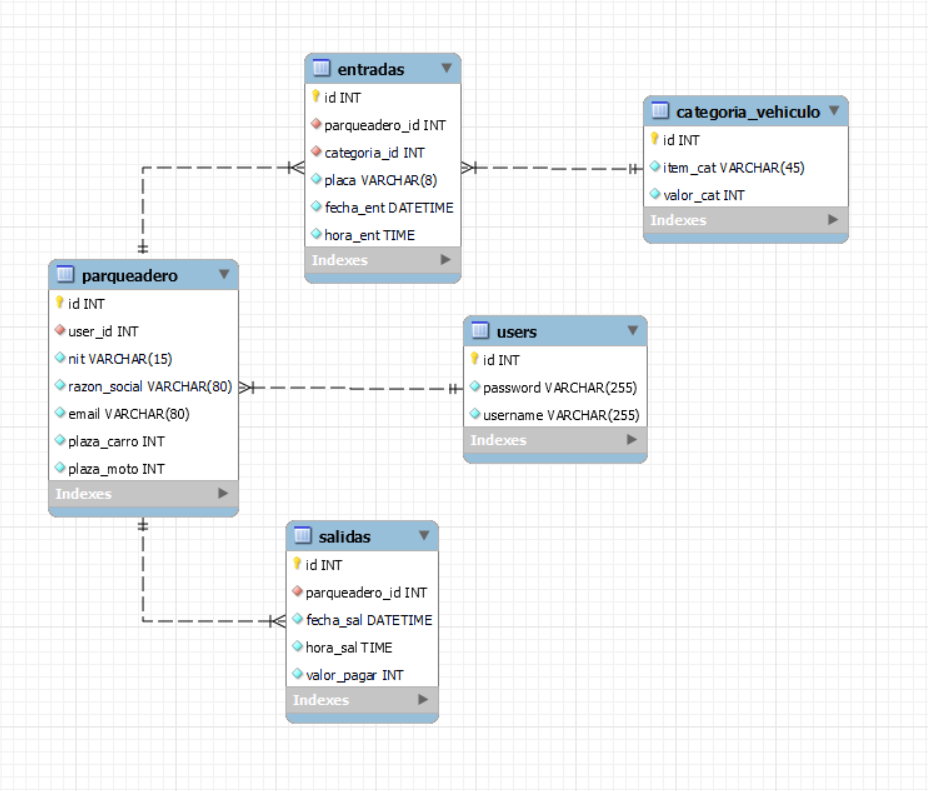
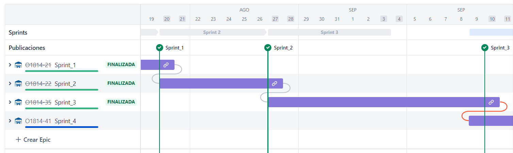
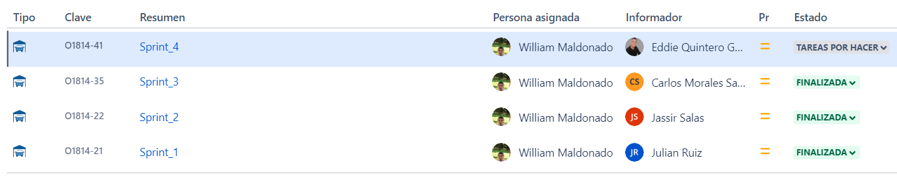
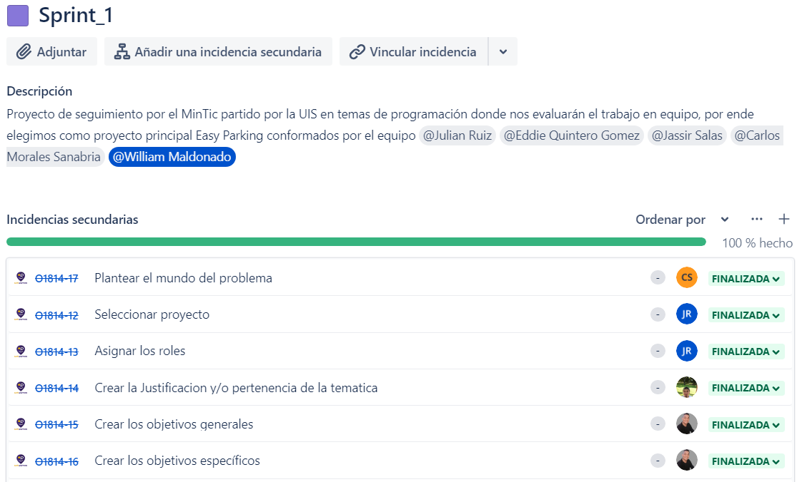
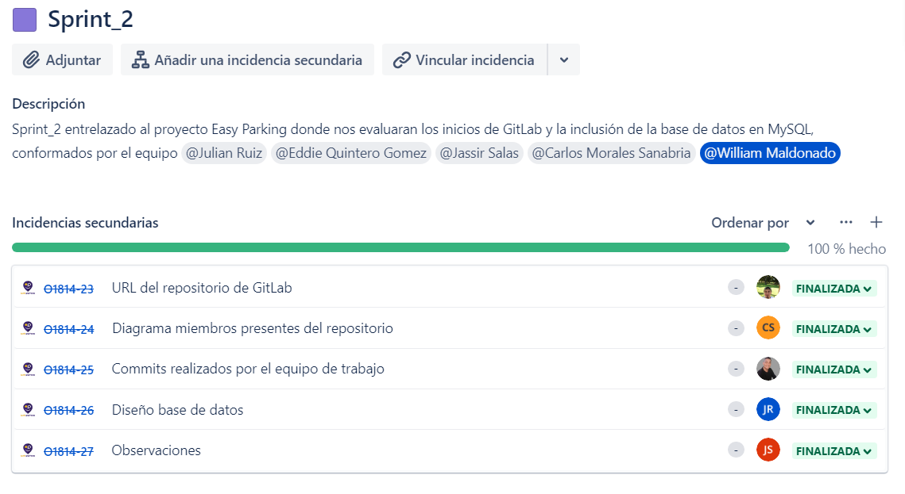
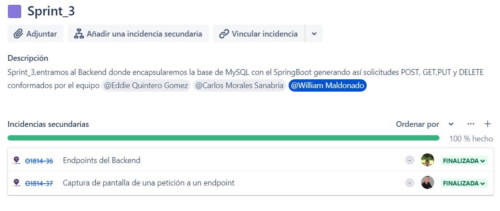
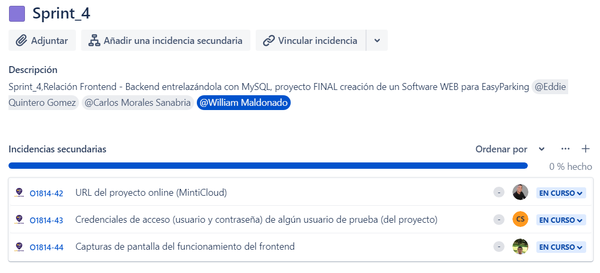

# Mision TIC 2022 - Base proyecto ciclo 3 - Grupo O18-14

# Componenentes

1. **EasyParkingO18_14-backend**: [Repositorio del backend](https://gitlab.com/O1814/EasyParking)
2. **EasyParkingO18_14-frontend**: [Repositorio del frontend](https://gitlab.com/O1814/EasyParking/-/tree/main/src/main/resources/public)

### Mundo del problema

Actualmente en Colombia y según datos del registro único nacional de tránsito RUNT en Colombia hay más de 17 millones de vehículos a cierre de 2021. (Avendaño, 2022). A raíz del gran número de vehículos en el país han surgido varios problemas de movilidad donde uno de esos factores es debido a que los vehículos que circulan por la calle están en busca de estacionamientos, y los que ya están ubicados en algún estacionamiento también generan más congestión lo que hace que los automotores sin opciones de parqueo deban esperar por un cupo para guardar su automóvil o en caso contrario parquearlos en algún lugar libre.
Sumado a lo anterior en muchos estacionamientos la velocidad con la cual se gestiona y se controla la entrada y salida de vehículos no es la más rápida, por lo que sí a la gran cantidad de coches se le suma la demora en un parqueadero desencadena un problema mucho mayor a resolver, y más teniendo en cuenta que año tras año el sector automotor va en aumento.
Ante esta situación presentada surge la necesidad de construir una aplicación ‘Software’ que permita brindar una solución más rápida y práctica en los parqueaderos para dar solución no solo en nivel de productividad, sino también en temas de (reducción de hurtos, operatividad, costos, control de tiempos de entrada y salida, ubicación del vehículo, identificación de automotores, etc..) donde finalmente se mitigarán problemas y se atenderá de una mejor manera la alta demanda vehicular.

### Objetivo general

Construir una aplicación ‘Software’ dirigido a personas y microempresarios para el rubro de estacionamiento en las zonas urbanas-comerciales con el fin de llevar nuevos procesos de transformación digital

### Objectivos espesificos

• Identificar los procesos de facturación, control de registros, ingresos y egresos en el área de administración para la obtención de un esquema dinámico y factible que pueda ser entendible y fácil en su uso asegurando la conectividad del Software-dueño-conductor.

• Analizar los puntos críticos de gestión que representen un problema concerniente a los procesos estratégicos en el manejo operativo, proceso de instalación y personal con el fin de resolver las necesidades de sistematización en el aparcamiento.

• Desarrollar un Software libre que integre la información modular y versátil donde el dueño adquiera detalle de los procesos gestionables de su microempresa; y de igual forma, pueda administrar y tramitar sus necesidades contables, orientado a mejorar los procesos tecnológicos del estacionamiento resaltando la conectividad del cliente-seguridad-vehículo.

### Requerimientos funcionales

---

<table>
<colgroup> 
    <col  style = "background-color: #AB4B4B" > 
  </colgroup> 
  <tr>
    <th>Nombre</th>
    <td>Registro en el sistema</td>
  </tr>
  <tr>
    <th>Prioridad</th>
    <td>Alta</td>
  </tr>
  <tr>
    <th>Descripción</th>
    <td>
        

    El administrador del parqueadero deberá registrarse en el sistema para poder usar Easy Parking, esto por medio de un campo en la interfaz donde el usuario ingresa su tipo de documento, número de identidad, contraseña y por último confirmación de esta. Consiguiente a esto, el sistema desplegará uno de los siguientes mensajes: "usuario registrado" si el usuario se ha registrado correctamente  o "usuario ya existe"
    

    </td>
  </tr>
  <tr>
    <th>Historias de usuario</th>
    <td>
        <ul>
        <li>El sistema debe validar si los datos ingresados son correctos (el número de documento debe ser        exclusivamente numérico).  
            ●	El sistema valida si es un nuevo usuario, o si ya existe dentro de la base de datos.  
            ●	El sistema guarda los datos ingresados en la base de datos asociada.</li>
        </ul>
    </td>
  </tr>
</table>

---

<table>
<colgroup> 
    <col  style = "background-color: #AB4B4B" > 
  </colgroup> 
  <tr>
    <th>Nombre</th>
    <td>Inicio de sesión</td>
  </tr>
  <tr>
    <th>Prioridad</th>
    <td>Alta</td>
  </tr>
  <tr>
    <th>Descripción</th>
    <td>
        

    Cada vez que el administrador desee utilizar Easy Parking deberá iniciar sesión en la aplicación. Para esto, existe un campo en la interfaz donde el usuario será capaz de ingresar su número de documento de identidad y contraseña. Posteriormente, el sistema desplegará uno de los siguientes mensajes: "usuario no registrado" si el usuario no figura en la base de datos, “contraseña incorrecta” si el usuario figura en la base de datos pero la contraseña no fue ingresada correctamente y finalmente, lleva al usuario a la pantalla principal de Easy Parking.
    

    </td>
  </tr>
  <tr>
    <th>Historias de usuario</th>
    <td>
        <ul>
        <li>El sistema valida si los datos ingresados figuran correctamente en la base de datos.</li>
        </ul>
    </td>
  </tr>
</table>

---

<table>
<colgroup> 
    <col  style = "background-color: #AB4B4B" > 
  </colgroup> 
  <tr>
    <th>Nombre</th>
    <td>Ingresar un carro</td>
  </tr>
  <tr>
    <th>Prioridad</th>
    <td>Alta</td>
  </tr>
  <tr>
    <th>Descripción</th>
    <td>
        

    El administrador ingresa un carro y lo ubica en la plaza que desee. Para esto el administrador dispondrá de varios campos en los que podrá ingresar la placa del automotor, la hora de llegada y la plaza en donde se ubicó, estos datos irán directamente a la base de datos y mostrará los siguientes mensajes: “Error al ingresar” en el caso de que haya un error sintáctico en los datos y “Se ingresó correctamente” en el caso de que todos los datos ingresados sean correctos. Adicionalmente, al ingresar el automotor empieza un contador desde la hora ingresada, para así hacer el cálculo y la facturación.
    

    </td>
  </tr>
  <tr>
    <th>Historias de usuario</th>
    <td>
        <ul>
        <li>Se debe tener acceso a la base de datos para poder ingresar los datos en esta. 
            ●	Al ingresar un cliente empezará un contador desde la hora ingresada. </li>
        </ul>
    </td>
  </tr>
</table>

---

<table>
<colgroup> 
    <col  style = "background-color: #AB4B4B" > 
  </colgroup> 
  <tr>
    <th>Nombre</th>
    <td>Actualizar una plaza</td>
  </tr>
  <tr>
    <th>Prioridad</th>
    <td>Alta</td>
  </tr>
  <tr>
    <th>Descripción</th>
    <td>
        

    El administrador actualiza la plaza deseada ya sea para corregir los datos del automotor que ingresó o para actualizar la plaza a vacío cuando un automotor salga del parqueadero.
    

    </td>
  </tr>
  <tr>
    <th>Historias de usuario</th>
    <td>
        <ul>
        <li>El sistema debe acceder a la base de datos y actualizar las casillas modificadas 
            ●	Terminar el contador de tiempo y mostrar un mensaje con el precio a cobrar.</li>
        </ul>
    </td>
  </tr>
</table>

---

### Requerimientos no funcionales

1. <b>Eficiencia</b>
    <ul>
      <li> El sistema podrá procesar e identificar la entrada y salida de automóviles al tiempo en las diferentes entradas del parqueadero.</li>
      <li>La base de datos se actualizará para todos los usuarios en el momento que procese la entrada o salida del vehículo.</li>
      <li>Se podrá llevar un registro diario de los ingresos y automóviles, el cual podrá ser graficado y analizado estadísticamente.</li>
   </ul>

2. <b>Usabilidad</b>
   <ul>
   <li> El sistema será compatible con navegadores Firefox, Chrome y Edge.</li> 
   <li> La curva de instrucción deberá ser escalada en menos de 5 horas.</li> 
   </ul>

3. <b>Disponibilidad</b>
   <ul>
   <li> El sistema tendrá un diseño Responsive Design que se ajustará a todo tipo de monitores y resoluciones de pantalla.</li> 
   <li> Se dispondrá de una documentación manual para el uso del sistema.</li> 
    </ul>

4. <b>Seguridad</b>
   <ul>
   <li> La base de datos funcionará sobre MySQL.</li> 
   <li> Se realizará una copia de seguridad global, diaria, cada que la jornada laboral finalice.</li> 
    </ul>

### Modelo de datos planteado

### Gestión del marco de trabajo Scrum en Jira

##### Epicas

##### Sprints

##### Historias de usuario

### Demo

Prueba la [Demo](https://o1814.gitlab.io/EasyParking).

